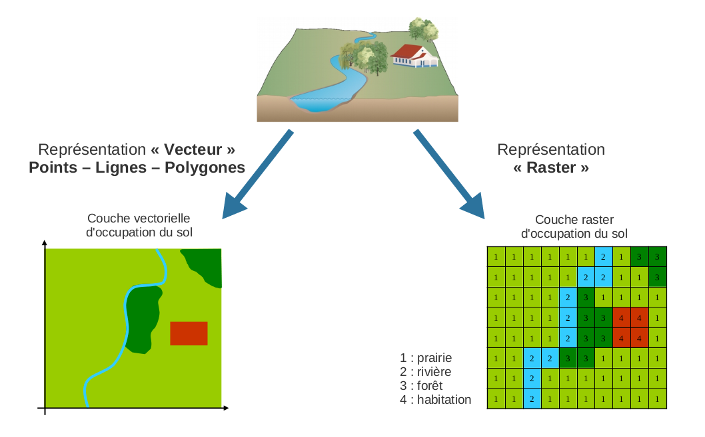
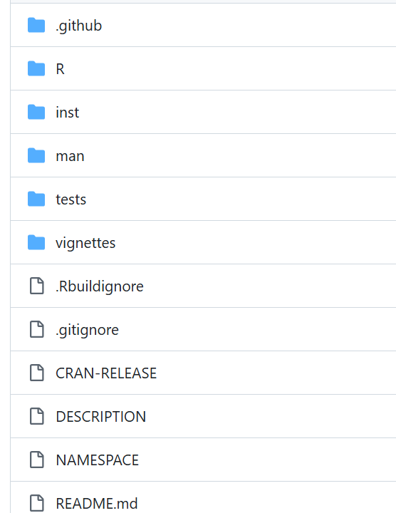
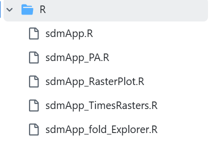
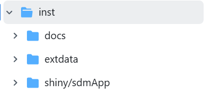
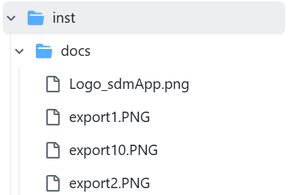
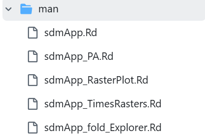
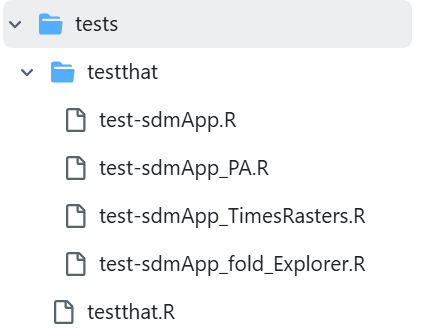
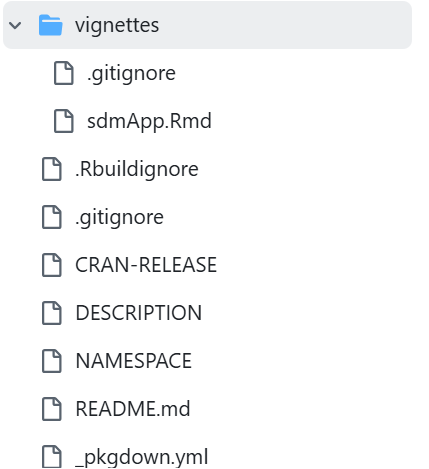

---
output:
  xaringan::moon_reader:
    css: ["css/default.css","css/metropolis.css", "css/metropolis-fonts.css"]
    nature:
      highlightStyle: "github"
      countIncrementalSlides: false
      ratio: "16:9"  # Format 16:9 pour plein écran
      
---

background-color: #ffffff
class: center, middle


<!-- Ligne avec logos et noms -->
<div style="display: flex; justify-content: space-between; align-items: center; margin-bottom: 10px;">

  <!-- Bloc ENSAE -->
  <div style="text-align: center;">
    <div style="font-size: 15px; margin-top: 10px;">
      <strong>Ecole Nationale de la Statistique<br>et de l'Analyse Economique</strong>
    </div><br>
    
  </div>
  
   <!-- Bloc SENEGAL -->
  <div style="text-align: center;">
    <div style="font-size: 20px; margin-top: 0px;">
      <strong>République du Sénégal</strong>
    </div><br>
    
  </div>

  <!-- Bloc ANSD -->
  <div style="text-align: center;">
    <div style="font-size: 15px; margin-top: 10px;">
      <strong>Agence Nationale de la Statistique<br>et de la Démographie</strong>
    </div><br>
    
  </div>
</div>

<!-- Bloc Nom du cours -->
<div style="margin-top: 90px; justify-content: space-between;">
  <h1 style="color: #007BFF; text-align: center; font-weight: bold; font-size: 35px;">Projet statistique sous R</h1>
</div>

<!-- Bloc Theme -->
<div style="margin-top: 20px; margin-bottom: 20px;">
  <h2 style="color: #007BFF; font-weight: bold; text-align: center; font-size: 40px;">Thème : Développement d'un package (cas de sdmApp)</h2>
</div>

<!-- Bloc membres du groupe et nom du professeur -->
<div style="display: flex; justify-content: space-between; margin-top: 50px; font-size: 18px;">
  <div style="text-align: left;">
    <strong>Membres du groupe</strong><br>
    Cheikh Oumar DIALLO<br>
    G. Judicaël Oscar KAFANDO
  </div>
  <div style="text-align: right;">
    <strong>Professeur</strong><br>
    M. HEMA Aboubacar
  </div>
</div>

<!-- Bloc Date -->
<div style="position: absolute; bottom: 30px; width: 100%; text-align: center; font-size: 16px;">
  `r format(Sys.Date(), "%d %B %Y")`
</div>

<!--Parametres généraux-->

```{r setup, include=FALSE}

# Ce code permet d'appliquer ces paramètres a tous les chuncks

knitr::opts_chunk$set(cache=TRUE, 
                      echo = FALSE, # N'affiche pas les codes
                      message=FALSE, # Supprime les messages générés par les packages lors de leur chargement.
                      warning=FALSE) # Masque les avertissements générés pendant l'exécution du code.
                      
         

```


<!--Installation des package-->

```{r }

packages <- c("dplyr","kableExtra","pkgsearch","gtsummary","devtools","cranlogs","tidyr","ggplot2","lubridate")

for (package in packages) {
  if(!requireNamespace(package)){ #verifie si le package n'existe pas déja
    install.packages(package) # installer en cas de non existence
  }
  
  library(package,character.only = TRUE) #chargement des packages
}

```

---
<!--Plan de présentation-->

# **📝 Plan de la Présentation**

🧭 **1. Introduction** 

<br>

📚 **2. Définition des concepts clés**

<br>

📦 **3. Présentation du package sdmApp**

<br>

🛠️ **4. Cas pratique**

<br>

⚠️ **5. Limites et suggestions**


<!--Introduction-->

---
background-color: #3EB489
class: inverse, center, middle, large

# <span style="color:#FFFFFF">📘 Introduction</span>

---
# **📘 Introduction**

## **📌 Contexte et justification**

- 🧭**Contexte** 

  Stage au sein du ***centre international de recherche agronomique (CIRAD)***

  - **📝 thème**:  *modélisation de la distribution des espèces ligneuses dans le bassin arachidier sénégalais *
  
  - ✅**Taux de réussite** : *98%*
  
<br>

--

- 💡**Justification** : 

  - *Sujet d'actualité*
  
  - *Facilité la modélisation*

---

# **📘 Introduction**

## **👥 Auteurs** 

  Plusieurs personnes ont intervenues dans la mise en oeuvre du package **sdmApp**. Il s'agit de :
  
  - M. Aboubacar HEMA : ***auteur et créateur***
  
  - M. Babacar NDAO : ***auteur***,
  
  - Mme. Louise LEROUX : ***auteur***, 
  
  - M. Abdoul Aziz DIOUF : ***auteur***


---
# <span style="color:#FFFFFF">📘 Introduction</span>

## **🕰️ Historique**

<!--Historique du package-->

**sdmApp, de sa création à nos jour.**

```{r echo=FALSE,message=FALSE,warning=FALSE}

# Créer le tableau
sdmApp_hist <- cran_package_history("sdmApp") %>% 
  mutate(nb_dependencies = sapply(dependencies, function(dep) {
    if (is.null(dep)) return(0)
    else return(nrow(dep))
  })) %>% 
  select(Package, Version, `Date/Publication` = `Date/Publication`, 
         `Enregistrement sur CRAN` = crandb_file_date, 
         `Mise à jour` = date, 
         `Dépendances` = nb_dependencies)

```

<!--Affichage de la table-->

```{r echo=FALSE}

# Afficher la table formatée
sdmApp_hist %>%
  kable("html") %>%
  kable_styling(full_width = FALSE, position = "center")


```

--

Le package a été retiré du CRAN (archivé) le **10-02-2024**.Les raisons derriere cet acte sont entre autre :

- **Dépendances obsolètes** : dependais de  rgdal et rgeos, désormais archivées et non maintenues sur le CRAN. 

- **Importations non utilisées** : Le fichier de description (DESCRIPTION) indique l'importation du package sp, mais celui-ci n’est pas utilisé dans le code.

--

- **Manque de robustesse multiplateforme :** Plusieurs distributions Linux (Debian, Fedora) ont généré des notes lors des vérifications automatiques, montrant un manque de compatibilité avec ces environnements.

**source : https://cran-archive.r-project.org/web/checks/2024/2024-02-10_check_results_sdmApp.html**


---

class: inverse, center, middle, large

# <span style="color:#FFFFFF">🧠 Définition des concepts clés</span>

---
# **🧠 Définition des concepts clés**

## <span style="color:#228B22;">**📦 1. Package**</span>

Un *package*  est un ensemble cohérent de fichiers, programmes, bibliothèques, et métadonnées qui permettent d’installer et d’utiliser une fonctionnalité spécifique dans un environnement logiciel donné.

--
<br>

## <span style="color:#228B22;">**🌍 2. Modélisation de la distribution des espèces**</span>

La *modélisation de la distribution des espèces* consiste à prédire les zones géographiques où une espèce est présente ou absente, en fonction de variables environnementales (climat, sol, altitude, etc.).

--
<br>

## <span style="color:#228B22;">**🗺 3. Vecteurs**</span>

Un *vecteur* est un type de donnée spatiale utilisé pour représenter des entités géographiques précises à l’aide de points, lignes, ou polygones.


---

# **🧠 Définition des concepts clés**

## <span style="color:#228B22">**🗺️ 4. Raster**</span>

Un *raster* est une image composée d’une grille de pixels, chacun représentant une valeur spatiale (comme la température, l’altitude ou l’humidité) à un endroit précis

--

<div style="text-align: center;">
  
</div>


---

class: inverse, center, middle, large

# <span style="color:#FFFFFF">**🧪 Présentation du package sdmApp**</span>

---
# **🧪 Présentation du package sdmApp**

## <span style="color:#228B22">**🔍 Description**</span>


<div style="display: flex; justify-content: space-between; height: 100%;">

  <!-- Bloc de gauche -->
  <div style="width: 48%; justify-content: center; align-items: center; text-align: justify; padding: 20px; font-size: 20px;">
  
  <br><br>
  
  <strong>sdmApp (Species Distribution Models Application)</strong>
  
  <br><br>
  
  C'est un package R qui permet aux utilisateurs de R <em><strong>(experts et non experts)</strong></em> de modéliser facilement la distribution des espèces.
  
  </div>
  
  <!-- Barre verticale de séparation -->
  <div style="width: 4%; border-left: 2px solid #ccc; height: 80%;"></div>

  <!-- Bloc de droite : Image -->
  <div style="width: 48%; text-align: center;">
    
  </div>

</div>


---

# **🧪 Présentation du package sdmApp**

## <span style="color:#228B22">📁 **Structure du package**</span>


<div style="display: flex; justify-content: space-between; height: 100%;">

  <!-- Bloc de gauche -->
  <div style="width: 48%; justify-content: center; align-items: center; text-align: justify; padding: 20px; font-size: 20px;">
  
  <br><br>
  
  <strong>sdmApp est constitué de :</strong>
  <ul>
  <li>Dossier</li>
      
  <li>Sous dossier</li>
      
  <li>Fichier</li>
  </ul>
  </div>

  <!-- Barre verticale de séparation -->
  <div style="width: 4%; border-left: 2px solid #ccc; height: 80%;"></div>

  <!-- Bloc de droite : Image -->
  <div style="width: 48%; text-align: center;">
    
  </div>

</div>

---

# **🧪 Présentation du package sdmApp**

## <span style="color:#228B22">📁 **Structure du package**</span>

### <span style="color:#228B22">**1. Dossier R**</span>

<div style="display: flex; justify-content: space-between; height: 100%;">

  <!-- Bloc de gauche -->
  <div style="width: 48%; justify-content: center; align-items: center; text-align: justify; padding: 20px; font-size: 20px;">
  
  <br><br>
  
  C’est le dossier principal contenant les fichiers de scripts R.
  
  <br><br>
  
  Ces fichiers contiennent le code de création des différentes fonctions.

  
  </div>

  <!-- Barre verticale de séparation -->
  <div style="width: 4%; border-left: 2px solid #ccc; height: 80%;"></div>

  <!-- Bloc de droite : Image -->
  <div style="width: 48%; text-align: center;">
    
  </div>

</div>

---

# **🧪 Présentation du package sdmApp**

## <span style="color:#228B22">📁 **Structure du package**</span>

### <span style="color:#228B22">**2. Dossier inst**</span>

<div style="display: flex; justify-content: space-between; height: 100%;">

  <!-- Bloc de gauche -->
  <div style="width: 48%; justify-content: center; align-items: center; text-align: justify; padding: 20px; font-size: 20px;">
  
  <br><br>
  
  Il s’agit du dossier "installation" standard dans les packages R. 
  
  <br>
  
  Il contient les ressources qui doivent être installées avec le package (documentation, images, données d'exemple)
  
  </div>

  <!-- Barre verticale de séparation -->
  <div style="width: 4%; border-left: 2px solid #ccc; height: 80%;"></div>

  <!-- Bloc de droite : Image -->
  <div style="width: 48%; text-align: center;">
    
    
  </div>

</div>

---

# **🧪 Présentation du package sdmApp**

## <span style="color:#228B22">📁 **Structure du package**</span>

### <span style="color:#228B22">**3. Dossier man**</span>

<div style="display: flex; justify-content: space-between; height: 100%;">

  <!-- Bloc de gauche -->
  <div style="width: 48%; justify-content: center; align-items: center; text-align: justify; padding: 20px; font-size: 20px;">
  
  <br><br>
  
  Ce dossier contient les fichiers de documentation des différentes fonctions du package, générées automatiquement par roxygen2
  
  </div>

  <!-- Barre verticale de séparation -->
  <div style="width: 4%; border-left: 2px solid #ccc; height: 80%;"></div>

  <!-- Bloc de droite : Image -->
  <div style="width: 48%; text-align: center;">
    
  </div>

</div>

---

# **🧪 Présentation du package sdmApp**

## <span style="color:#228B22">📁 **Structure du package**</span>

### <span style="color:#228B22">**4. Dossier test**</span>

<div style="display: flex; justify-content: space-between; height: 100%;">

  <!-- Bloc de gauche -->
  <div style="width: 48%; justify-content: center; align-items: center; text-align: justify; padding: 20px; font-size: 20px;">
  
  <br><br>
  
  Ce dossier contient les tests unitaires et fonctionnels pour vérifier le bon fonctionnement du package.

  <br>
  
  Pour toutes les fonctions, seul la <strong>multiplication</strong> a été tester.
  
  </div>

  <!-- Barre verticale de séparation -->
  <div style="width: 4%; border-left: 2px solid #ccc; height: 80%;"></div>

  <!-- Bloc de droite : Image -->
  <div style="width: 48%; text-align: center;">
    
  </div>

</div>

---


# **🧪 Présentation du package sdmApp**

## <span style="color:#228B22">📁 **Structure du package**</span>

### <span style="color:#228B22">**5. Dossier vignette**</span>

<div style="display: flex; justify-content: space-between; height: 100%;">

  <!-- Bloc de gauche -->
  <div style="width: 48%; justify-content: center; align-items: center; text-align: justify; padding: 20px; font-size: 20px;">
  
  <br><br>
    
  Ce dossier contient les documents explicatifs détaillés sur les fonctionnalités et l'utilisation du package

  </div>

  <!-- Barre verticale de séparation -->
  <div style="width: 4%; border-left: 2px solid #ccc; height: 80%;"></div>

  <!-- Bloc de droite : Image -->
  <div style="width: 48%; text-align: center;">
    
  </div>

</div>

---

# **🧪 Présentation du package sdmApp**

## <span style="color:#228B22">🧰 **Fonctionnalités du package**</span>

Le package **sdmApp** est composé de cinq fonctions.

<br>

--

### <span style="color:#228B22">**1. sdmApp()**</span>

Elle est la fonction principale du package. Elle permet de lancer l'application et d'y faire le **chargement, la visualisation, la modélisation des données et l'exportation des résultats.**


--

### <span style="color:#228B22">**2. sdmApp_PA()**</span>

Elle affiche une carte à partir d’un **objet raster binaire** représentant ***la présence (1) en vert ou l’absence (0) en rouge*** d’une espèce sur une zone géographique.

---

# **🧪 Présentation du package sdmApp**

## <span style="color:#228B22">🧰 **Fonctionnalités du package**</span>

### <span style="color:#228B22">**3. sdmApp_TimesRasters()**</span>


Elle sert à masquer les **absences** dans une carte de **probabilité d’occurrence** , en multipliant cette carte par une carte binaire de présence/absence. 

--

### <span style="color:#228B22">**4. sdmApp_fold_Explorer()**</span>

Elle permet de visualiser les **folds (blocs de validation croisée spatiale)** générés avec ***blockCV***, en les superposant à une carte raster et aux points d’occurrence d’espèce.


--

### <span style="color:#228B22">**5. sdmApp_RasterPlot()**</span>

Elle permet de créer une jolie carte raster en utilisant ggplot2, ce qui permet une meilleure personnalisation et une intégration élégante dans des Shiny apps.

---
# **🧪 Présentation du package sdmApp**

## <span style="color:#228B22">**📊 Comparaison avec d'autres packages**</span>


La modélisation de la distribution des espèces est un point qui a nécessité la création de plusieurs packages afin de rendre la tache plus simple. sdmApp s'est aligné sur cette dynamique. Dans cette partie, nous comparons les différents packages à sdmApp, en terme de nombre d'utilisation par les internautes de R.

<!--Récupération des données-->

```{r }


Base_nbre_telechargement <- cranlogs::cran_downloads(package = c("sdmApp","sdm","dismo","biomod2","maxnet","SDMtune"), #liste des packages à comparer
                            from = "2020-01-01", to = Sys.Date()) # choix de la période à considérée


# Ajouter une colonne "année" à la base afin de faciliter les filtres
Base_nbre_telechargement <- Base_nbre_telechargement %>%
  dplyr::mutate(Année = lubridate::year(date))


```

<!--Agréger les données par package et année-->

```{r}

Base_nbre_telechargement_an <- Base_nbre_telechargement %>%
  dplyr::group_by(package, Année) %>%
  dplyr::summarise(Nbre_telechargement = sum(count), .groups = "drop")

```

<!--Tableau récapitulatif-->

```{r}

# Réorganiser : années en lignes, packages en colonnes
Base_telechargement <- Base_nbre_telechargement_an %>%
  tidyr::pivot_wider(names_from = package, values_from = Nbre_telechargement)

# Afficher joliment le tableau
Base_telechargement %>%
  kable("html", caption = "Nombre de téléchargements par année et par package") %>%
  kable_styling(bootstrap_options = c("striped", "hover", "condensed", "responsive"), 
                full_width = FALSE, position = "center")

```

---

# **🧪 Présentation du package sdmApp**

## <span style="color:#228B22">**📊 Comparaison avec d'autres packages**</span>

<br>

<!--Courbe de visualisation-->

```{r fig.width=10, fig.height=5, fig.align='center'}

# Tracer le graphique
ggplot(Base_nbre_telechargement_an, aes(x = Année, y = Nbre_telechargement, color = package)) +
  geom_line(size = 1.2) +
  geom_point(size = 2) +
  labs(title = "Évolution des téléchargements des packages SDM (2020-2025)",
       x = "Année", y = "Nombre de téléchargements") +
  theme_minimal() +
  theme(
    plot.title = element_text(face = "bold", size = 18, hjust = 0.5),
    legend.title = element_blank()
  )

```

---

class: inverse, center, middle, large

# [<span style="color:#FFFFFF">🖥️ Cas Pratique : Interface Graphique</span>](http://127.0.0.1:5547)


---

class: inverse, center, middle, large

# <span style="color:#FFFFFF">⚠️ Limites et Suggestions</span>

---
# **⚠️ Limites et Suggestions**

## ❌ **Limites du package**

<br>

- **🔧 Dépendance vis-à-vis d'autres packages ** : le rends vulnérable

- **🔧 Dépendance à Java :** Java (≥ 8) est requis, ce qui complique l’installation, notamment sur Windows.

--

- ⚙️**Personnalisation faible : **L’interface est simple, mais peu flexible : l’utilisateur avancé ne peut pas facilement modifier les paramètres internes des modèles via l'interface.


---

# <span style="color:#FFFFFF">⚠️ Limites et Suggestions</span>

## 💡 **Suggestions d'amélioration**

<br>

- **✔️ Supprimer la dépendance Java** : Passer à des bibliothèques purement R pour les fonctions critiques.

--

- **🛠️ Plus de personnalisation** : Ajout d’un onglet “paramètres avancés” pour permettre à l’utilisateur d’éditer le code R généré en direct.

--

- **📦 Version cloud ou déployable** : Déployer une version web en ligne (via Shinyapps.io ou Docker) pour éviter les soucis d'installation locale.

--

- ✅**Ajout d'une fonctionnalité ** : ajouter une fonctionnalité permettant de determiner pour une espèce donnée, la durée de vies dans l'environnement dans le cas où il peut exister.


---

class: inverse, center, middle, large

# 🙏 Merci pour votre aimable attention  

